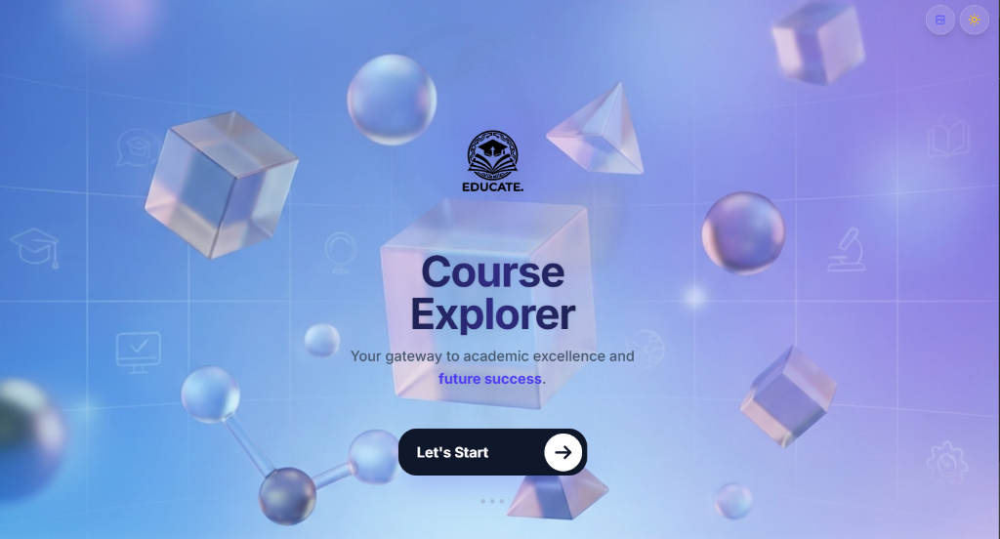

# 🎓 OFPPT Course Explorer - Premium Edition



A next-generation educational platform built with **React**, **Vite**, and **Tailwind CSS v4**. This application features a high-end "Smart UI" with 3D interactivity, dynamic glassmorphism, and a seamless API integration for browsing OFPPT curriculum content.

## ✨ Key Features

### 🧠 Smart 3D Interface
-   **3D Tilt Cards**: Interactive formation and module cards that respond to mouse movement with realistic depth and lighting effects.
-   **Magnetic Interactions**: Buttons and interactive elements feature magnetic hover physics.
-   **Parallax Hero**: The welcome screen features a depth-aware paralax background system.

### 🎨 Dynamic Theme Engine
-   **5+ Premium Backgrounds**: Integrated "Smart Switcher" allows users to cycle through 5 unique high-res backgrounds (Glass, Neon, Geometric, etc.).
-   **Glassmorphism**: Advanced backdrop-blur and translucency effects that adapt to the selected background.
-   **Dark Mode**: Fully supported system-wide dark mode with specialized neon accents.

### 🚀 Advanced Architecture
-   **Complete API Integration**: Full browsing flow from Years → Formations → Modules → Courses → Resources.
-   **Smart Caching**: Efficient data handling with loading states and error boundaries.
-   **Responsive Grid**: Optimized layouts for mobile, tablet, and desktop screens.
-   **Download Manager**: One-click download for PDF lessons and exams.

## 🛠️ Tech Stack

-   **Frontend**: React 18
-   **Build Tool**: Vite 6
-   **Styling**: Tailwind CSS v4 (Alpha)
-   **Routing**: React Router DOM 7
-   **Icons**: Custom SVG System (Smart Iconography)
-   **State Management**: React Hooks + LocalStorage
-   **HTTP Client**: Axios with Interceptors

## 📦 Installation

clone the repository:
```bash
git clone https://github.com/zaidbouallala-alb/ofppt-course-explorer.git
cd ofppt-course-explorer
```

Install dependencies:
```bash
npm install
```

Start the development server:
```bash
npm run dev
```

## 🏗️ Project Structure

```bash
src/
├── api/                # Axios client and service endpoints
├── components-app/     # Smart UI components (TiltCard, Welcome, etc.)
├── pages/             # Route pages (Formations, Modules, Courses)
├── i18n/              # Localization files
└── styles/            # Tailwind and global themes
public/
└── backgrounds/       # Dynamic background assets
```

## 🌟 Smart Features Showcase

### 1. Context-Aware Icons
The app automatically detects the type of content (e.g., "Development", "Infrastructure", "Design") and assigns custom 3D icons and color themes dynamically.

### 2. EFM & Control Filtering
Intelligent filtering logic separates course materials into **Lessons**, **Controls** (Continuous Assessment), and **EFMs** (Final Exams) tabs automatically based on file naming conventions.

## 🤝 Contributing

1.  Fork the project
2.  Create your Feature Branch (`git checkout -b feature/AmazingFeature`)
3.  Commit your Changes (`git commit -m 'Add some AmazingFeature'`)
4.  Push to the Branch (`git push origin feature/AmazingFeature`)
5.  Open a Pull Request

---

*Built with ❤️ for the OFPPT Community*
